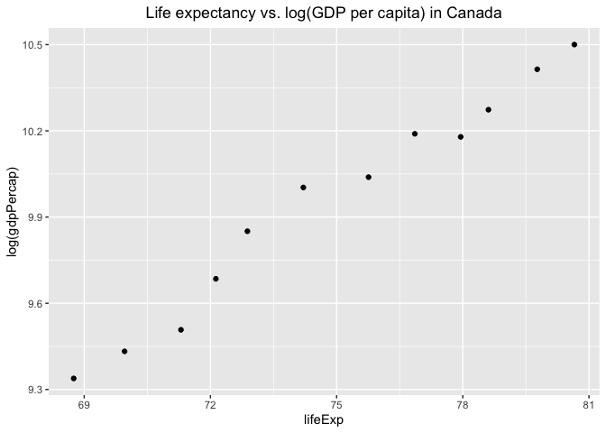
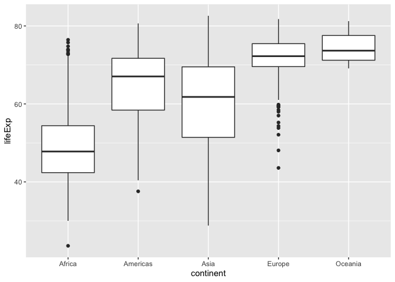
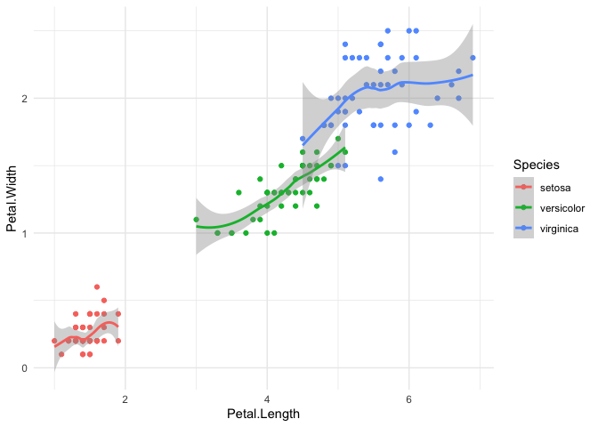
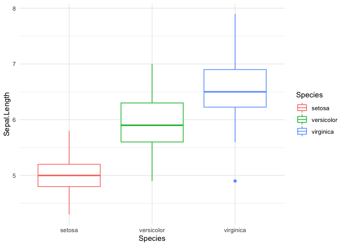

A2: Explore Gapminder and Use dplyr
================

Exercise 1: Basic `dplyr`
=========================

1.1
---

``` r
cuj <- filter(gapminder, year %in% seq(1970,1979,1), 
        country == "China" | country ==  "United States" | country == "Japan")
cuj
```

    ## # A tibble: 6 x 6
    ##   country       continent  year lifeExp       pop gdpPercap
    ##   <fct>         <fct>     <int>   <dbl>     <int>     <dbl>
    ## 1 China         Asia       1972    63.1 862030000      677.
    ## 2 China         Asia       1977    64.0 943455000      741.
    ## 3 Japan         Asia       1972    73.4 107188273    14779.
    ## 4 Japan         Asia       1977    75.4 113872473    16610.
    ## 5 United States Americas   1972    71.3 209896000    21806.
    ## 6 United States Americas   1977    73.4 220239000    24073.

1.2
---

``` r
cuj %>% 
  select(country, gdpPercap)
```

    ## # A tibble: 6 x 2
    ##   country       gdpPercap
    ##   <fct>             <dbl>
    ## 1 China              677.
    ## 2 China              741.
    ## 3 Japan            14779.
    ## 4 Japan            16610.
    ## 5 United States    21806.
    ## 6 United States    24073.

1.3
---

``` r
inc.in.lifeExp <- c(diff(gapminder$lifeExp), NA) #create a new variable of difference
gapminder %>%  mutate(inc.in.lifeExp) %>%  #add variable as a column into gapminder
  filter(inc.in.lifeExp < 0) #discard entries with a positive difference 
```

    ## # A tibble: 221 x 7
    ##    country   continent  year lifeExp      pop gdpPercap inc.in.lifeExp
    ##    <fct>     <fct>     <int>   <dbl>    <int>     <dbl>          <dbl>
    ##  1 Albania   Europe     1987    72    3075321     3739.         -0.419
    ##  2 Albania   Europe     2007    76.4  3600523     5937.        -33.3  
    ##  3 Algeria   Africa     2007    72.3 33333216     6223.        -42.3  
    ##  4 Angola    Africa     1982    39.9  7016384     2757.         -0.036
    ##  5 Argentina Americas   2007    75.3 40301927    12779.         -6.20 
    ##  6 Australia Oceania    2007    81.2 20434176    34435.        -14.4  
    ##  7 Austria   Europe     2007    79.8  8199783    36126.        -28.9  
    ##  8 Bahrain   Asia       2007    75.6   708573    29796.        -38.2  
    ##  9 Belgium   Europe     2007    79.4 10392226    33693.        -41.2  
    ## 10 Benin     Africa     1997    54.8  6066080     1233.         -0.371
    ## # … with 211 more rows

1.4
---

``` r
maxgdata <- gapminder %>% 
  group_by(country) %>% 
  filter(gdpPercap == max(gdpPercap))
maxgdata
```

    ## # A tibble: 142 x 6
    ## # Groups:   country [142]
    ##    country     continent  year lifeExp       pop gdpPercap
    ##    <fct>       <fct>     <int>   <dbl>     <int>     <dbl>
    ##  1 Afghanistan Asia       1982    39.9  12881816      978.
    ##  2 Albania     Europe     2007    76.4   3600523     5937.
    ##  3 Algeria     Africa     2007    72.3  33333216     6223.
    ##  4 Angola      Africa     1967    36.0   5247469     5523.
    ##  5 Argentina   Americas   2007    75.3  40301927    12779.
    ##  6 Australia   Oceania    2007    81.2  20434176    34435.
    ##  7 Austria     Europe     2007    79.8   8199783    36126.
    ##  8 Bahrain     Asia       2007    75.6    708573    29796.
    ##  9 Bangladesh  Asia       2007    64.1 150448339     1391.
    ## 10 Belgium     Europe     2007    79.4  10392226    33693.
    ## # … with 132 more rows

1.5
---

``` r
filter(gapminder, country %in% "Canada") %>% 
  select(country, lifeExp, gdpPercap) %>% 
  ggplot(aes(x = lifeExp, y = log(gdpPercap))) + geom_point() +
  labs(title = "Life expectancy vs. log(GDP per capita) in Canada") +
  theme(plot.title = element_text(hjust = 0.5)) #centering the title
```



Exercise 2
==========

The categorical variable and quantative variable of choice are continent and life expectancy, respectively.

**Q1: What are possible values (or range, whichever is appropriate) of each variable?**

**Solution:**

The possible values/groups of continent are Africa, Americas, Asia, Europe, and Oceania.

The range of life expectancy across all continents varies from 23.6 years old to 82.60 years old.

``` r
gapminder %>% group_keys(continent) #access possible values in continent
```

    ## # A tibble: 5 x 1
    ##   continent
    ##   <fct>    
    ## 1 Africa   
    ## 2 Americas 
    ## 3 Asia     
    ## 4 Europe   
    ## 5 Oceania

``` r
range(gapminder$lifeExp)
```

    ## [1] 23.599 82.603

**Q2: What values are typical? What’s the spread? What’s the distribution? Etc., tailored to the variable at hand.**

**Solution:**

Africa is the continent with the most information recorded in the gapminder dataset; specifically, it has 624 entries.

The most common value for life expectancy is 69.39 years old across all continents.

The spread of life expectancy data can be described by its IQR, standard deviation, and quantiles. For instance, its IQR is 22.6475 years old. Its standard deviation is 12.91711 years old. Lastly, the majority of the data lie between 48.198 and 70.8455 years old.

The life expectancy of Europeans and Africans contains many outliers, with that of the Europeans being the most. All continents except Africa and Oceania demonstrate left-skewness meaning that most people have a relatively high life expectancy. Oceanians' life expectancy is distributed approximately symmetrically without any outlier present. However, Africans' life expectancy is slightly skewed to the right suggesting that most people do not have a very high life expectancy.

``` r
gapminder %>% count(continent)
```

    ## # A tibble: 5 x 2
    ##   continent     n
    ##   <fct>     <int>
    ## 1 Africa      624
    ## 2 Americas    300
    ## 3 Asia        396
    ## 4 Europe      360
    ## 5 Oceania      24

``` r
getmode <- function(v) {
   uniqv <- unique(v)
   uniqv[which.max(tabulate(match(v, uniqv)))]
}
getmode(gapminder$lifeExp)
```

    ## [1] 69.39

``` r
sumtable <- as.table(summary(gapminder$lifeExp))
sumtable
```

    ##    Min. 1st Qu.  Median    Mean 3rd Qu.    Max. 
    ##   23.60   48.20   60.71   59.47   70.85   82.60

``` r
gapminder$lifeExp %>% sd()
```

    ## [1] 12.91711

``` r
gapminder$lifeExp %>% quantile()
```

    ##      0%     25%     50%     75%    100% 
    ## 23.5990 48.1980 60.7125 70.8455 82.6030

``` r
gapminder$lifeExp %>% IQR()
```

    ## [1] 22.6475

``` r
gapminder %>% ggplot(aes(x = continent, y = lifeExp)) + geom_boxplot() 
```



Exercise 3
==========

Below is a scatterplot depicting the relationship between petal length and petal width of different species of iris flowers from the `iris` dataset. Trend line with confidence region is also included for each species in order to generate a more clear trend.

We can see that the length and the width of iris petals are positively associated across all species. Furthermore, **virginica** appears to have the largest petals while **setosa** has the smallest overall.

``` r
iris %>%
  ggplot(aes(x=Petal.Length, y=Petal.Width, color = Species)) +
  geom_point() + theme_minimal() + geom_smooth()
```

    ## `geom_smooth()` using method = 'loess' and formula 'y ~ x'



A boxplot of species versus sepal length can be examined to visualize the length distribution across different iris flowers.

``` r
iris %>% 
  ggplot(aes(x=Species, y=Sepal.Length,color=Species)) +
  geom_boxplot() +theme_minimal() + theme(legend.position="right")
```



Recycling
=========

``` r
filter(gapminder, country == c("Rwanda", "Afghanistan"))
```

    ## # A tibble: 12 x 6
    ##    country     continent  year lifeExp      pop gdpPercap
    ##    <fct>       <fct>     <int>   <dbl>    <int>     <dbl>
    ##  1 Afghanistan Asia       1957    30.3  9240934      821.
    ##  2 Afghanistan Asia       1967    34.0 11537966      836.
    ##  3 Afghanistan Asia       1977    38.4 14880372      786.
    ##  4 Afghanistan Asia       1987    40.8 13867957      852.
    ##  5 Afghanistan Asia       1997    41.8 22227415      635.
    ##  6 Afghanistan Asia       2007    43.8 31889923      975.
    ##  7 Rwanda      Africa     1952    40    2534927      493.
    ##  8 Rwanda      Africa     1962    43    3051242      597.
    ##  9 Rwanda      Africa     1972    44.6  3992121      591.
    ## 10 Rwanda      Africa     1982    46.2  5507565      882.
    ## 11 Rwanda      Africa     1992    23.6  7290203      737.
    ## 12 Rwanda      Africa     2002    43.4  7852401      786.

Now, let's filter the observations individually to check if the analyst included all relevant observations.

``` r
filter(gapminder, country == "Rwanda")
```

    ## # A tibble: 12 x 6
    ##    country continent  year lifeExp     pop gdpPercap
    ##    <fct>   <fct>     <int>   <dbl>   <int>     <dbl>
    ##  1 Rwanda  Africa     1952    40   2534927      493.
    ##  2 Rwanda  Africa     1957    41.5 2822082      540.
    ##  3 Rwanda  Africa     1962    43   3051242      597.
    ##  4 Rwanda  Africa     1967    44.1 3451079      511.
    ##  5 Rwanda  Africa     1972    44.6 3992121      591.
    ##  6 Rwanda  Africa     1977    45   4657072      670.
    ##  7 Rwanda  Africa     1982    46.2 5507565      882.
    ##  8 Rwanda  Africa     1987    44.0 6349365      848.
    ##  9 Rwanda  Africa     1992    23.6 7290203      737.
    ## 10 Rwanda  Africa     1997    36.1 7212583      590.
    ## 11 Rwanda  Africa     2002    43.4 7852401      786.
    ## 12 Rwanda  Africa     2007    46.2 8860588      863.

``` r
filter(gapminder, country == "Afghanistan")
```

    ## # A tibble: 12 x 6
    ##    country     continent  year lifeExp      pop gdpPercap
    ##    <fct>       <fct>     <int>   <dbl>    <int>     <dbl>
    ##  1 Afghanistan Asia       1952    28.8  8425333      779.
    ##  2 Afghanistan Asia       1957    30.3  9240934      821.
    ##  3 Afghanistan Asia       1962    32.0 10267083      853.
    ##  4 Afghanistan Asia       1967    34.0 11537966      836.
    ##  5 Afghanistan Asia       1972    36.1 13079460      740.
    ##  6 Afghanistan Asia       1977    38.4 14880372      786.
    ##  7 Afghanistan Asia       1982    39.9 12881816      978.
    ##  8 Afghanistan Asia       1987    40.8 13867957      852.
    ##  9 Afghanistan Asia       1992    41.7 16317921      649.
    ## 10 Afghanistan Asia       1997    41.8 22227415      635.
    ## 11 Afghanistan Asia       2002    42.1 25268405      727.
    ## 12 Afghanistan Asia       2007    43.8 31889923      975.

The analyst only managed to produce 12 observations in total. However, it is clear that Rwanda and Afghanistan each has 12 observations. Therefore, the analyst did *not* suceed.

Below code would fix the analyst's error:

``` r
filter(gapminder, country == "Rwanda" | country == "Afghanistan")
```

    ## # A tibble: 24 x 6
    ##    country     continent  year lifeExp      pop gdpPercap
    ##    <fct>       <fct>     <int>   <dbl>    <int>     <dbl>
    ##  1 Afghanistan Asia       1952    28.8  8425333      779.
    ##  2 Afghanistan Asia       1957    30.3  9240934      821.
    ##  3 Afghanistan Asia       1962    32.0 10267083      853.
    ##  4 Afghanistan Asia       1967    34.0 11537966      836.
    ##  5 Afghanistan Asia       1972    36.1 13079460      740.
    ##  6 Afghanistan Asia       1977    38.4 14880372      786.
    ##  7 Afghanistan Asia       1982    39.9 12881816      978.
    ##  8 Afghanistan Asia       1987    40.8 13867957      852.
    ##  9 Afghanistan Asia       1992    41.7 16317921      649.
    ## 10 Afghanistan Asia       1997    41.8 22227415      635.
    ## # … with 14 more rows
