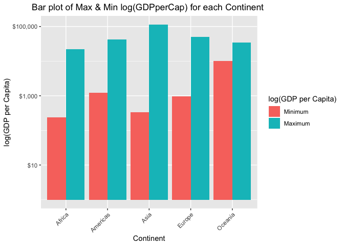
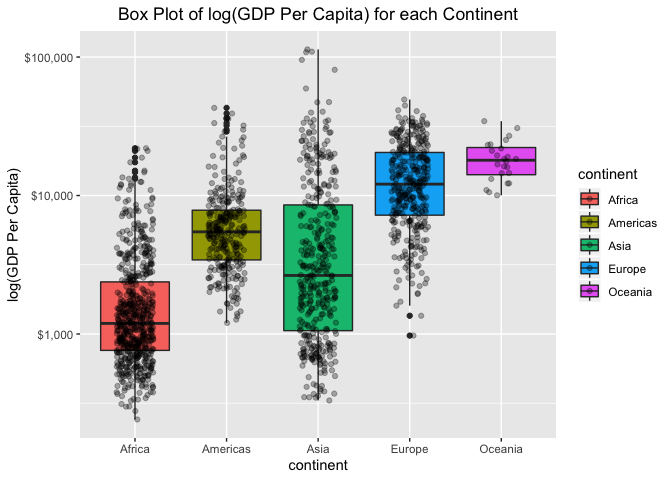
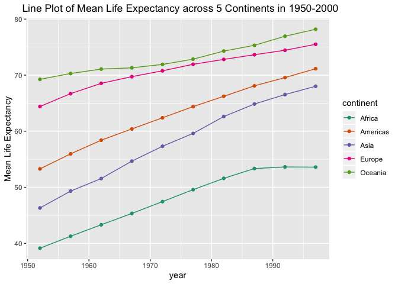

A3: dplyr/ggplot2 Part II
================

Task 1:
=======

### Get the maximum and minimum of GDP per capita for all continents.

Initially, create a new tibble by grouping the gapminder dataset by continent, then calculate the maximum and the minimum GDP per capita for each continent and append those data into the tibble as follows:

``` r
gapgdp <- gapminder %>% 
  group_by(continent) %>% 
  summarize(min.gdppercap = min(gdpPercap), max.gdppercap = max(gdpPercap)) %>% 
  as_tibble()
gapgdp
```

    ## # A tibble: 5 x 3
    ##   continent min.gdppercap max.gdppercap
    ##   <fct>             <dbl>         <dbl>
    ## 1 Africa             241.        21951.
    ## 2 Americas          1202.        42952.
    ## 3 Asia               331        113523.
    ## 4 Europe             974.        49357.
    ## 5 Oceania          10040.        34435.

The tibble above shows the maximum and the minimum GDP per capita for each continent. For instance, the minimum and the maximum GDP per capita for Africa are 241 dollars and 21951 dollars, respectively.

To helps us to obtain a better idea of how those numbers actually appear with respect to each other, we could construct a side-by-side barplot of minimum and maximum GDP per capita for each continent as shown below:

``` r
data.m <- melt(gapgdp, id.vars='continent')

ggplot(data.m, aes(continent, value)) +   
  geom_bar(aes(fill = variable), position = "dodge", stat="identity") +
  theme(axis.text.x = element_text(angle = 45, hjust = 1)) + # tilt variables' name
  scale_y_log10(labels = scales::dollar_format()) +
  labs(title = "Bar plot of Max & Min log(GDPperCap) for each Continent ",
       x = "Continent", y = "log(GDP per Capita)") +
  scale_fill_discrete(name = "log(GDP per Capita)",
                      labels = c("Minimum", "Maximum")) +
  theme(plot.title = element_text(hjust = 0.5))
```



From the bar plot above, it could be discerned that Asia has the greatest maximum GDP per capita overall, whereas Africa has the smallest minimum GDP per capita.

Task 2:
=======

### Look at the spread of GDP per capita within the continents.

The spread of GDP per capita for each continent can be reflected by interquartile range (IQR) and sample standard deviation.

``` r
spreadgdp <- gapminder %>% 
  group_by(continent) %>% 
  summarize(interquartile.range = IQR(gdpPercap), standard.deviation = sqrt(var(gdpPercap))) %>% 
  as_tibble()
spreadgdp
```

    ## # A tibble: 5 x 3
    ##   continent interquartile.range standard.deviation
    ##   <fct>                   <dbl>              <dbl>
    ## 1 Africa                  1616.              2828.
    ## 2 Americas                4402.              6397.
    ## 3 Asia                    7492.             14045.
    ## 4 Europe                 13248.              9355.
    ## 5 Oceania                 8072.              6359.

Based on the sample standard deviation, Asian countries have the greatest spread in GDP per capita. However, Europe contains the greatest spread across its countries if we consider IQR as the method of measurement.

``` r
gapminder %>% 
  ggplot(aes(x=continent,y=gdpPercap, fill=continent)) +
  geom_boxplot() + 
  geom_jitter(width=0.2,alpha=0.3) +
  scale_y_log10(labels = scales::dollar_format()) +
  labs(title = "Box Plot of log(GDP Per Capita) for each Continent", y = "log(GDP Per Capita)") +
  theme(plot.title = element_text(hjust = 0.5)) #centering
```



A boxplot of log(GDP per capita) versus continent is generated to visualize the spread of GDP per capita within the continents. Raw data points are plotted over the boxplot to visualize the regions of concentration of the data. It could be discerned that Asia indeed has the greatest spread in GDP per capita and Oceania has the least. Furthermore, most data points are concentrated at the lower 75% quantile for Africa, whereas it's the opposite in Europe.

Task 3:
=======

### How is life expectancy changing over time on different continents?

``` r
lifetrend <- gapminder %>% 
  group_by(continent, year) %>% 
  summarize(mean.lifeexp = mean(lifeExp)) %>%
  filter(year > 1950 & year < 2000) %>% 
  as_tibble()
lifetrend
```

    ## # A tibble: 50 x 3
    ##    continent  year mean.lifeexp
    ##    <fct>     <int>        <dbl>
    ##  1 Africa     1952         39.1
    ##  2 Africa     1957         41.3
    ##  3 Africa     1962         43.3
    ##  4 Africa     1967         45.3
    ##  5 Africa     1972         47.5
    ##  6 Africa     1977         49.6
    ##  7 Africa     1982         51.6
    ##  8 Africa     1987         53.3
    ##  9 Africa     1992         53.6
    ## 10 Africa     1997         53.6
    ## # … with 40 more rows

``` r
lifetrend %>% 
  ggplot(aes(x=year, y=mean.lifeexp, group=continent)) +
  geom_line(aes(color=continent))+
  geom_point(aes(color=continent)) +
  scale_color_brewer(palette="Dark2") + #make the line colors few tones darker
  labs(title = "Line Plot of Mean Life Expectancy across 5 Continents in 1950-2000",
       y = "Mean Life Expectancy") +
  theme(plot.title = element_text(hjust = 0.3))
```



A line plot is the most appropriate to visualize trends. It could be clearly concluded that, on average, life expectancy has been increasing across the globe from 1950 to 2000. In particular, Asia has the sharpest monotone increase compared to other continents. Overall, Oceanians have the highest mean life expectancy in 1950 to 2000.
