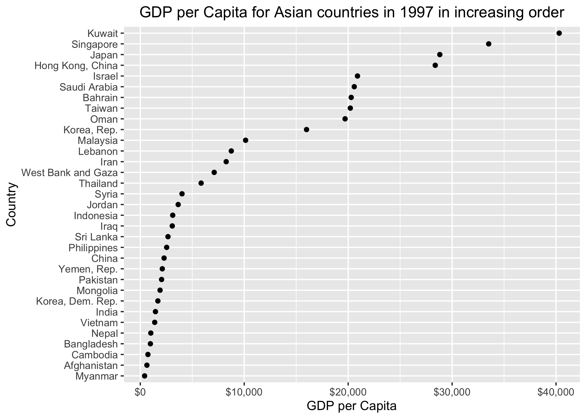

# Exercise 1
## Explain the value of `here::here` package

The `here` package is particularly useful when individuals are collaborating R projects. `here::here()` is platform-independent, meaning that it provides an universally executable directory pathway regardless of one's operating system. For instance, MacOS uses `/` to separate directories in a pathway whereas in Windows `\` is used instead. Hence, if collaborators in a team all use different operating systems, a file path specified by slashes would not be executable for everyone, thereby making the code very unrobust. This package would also locate a file relative to the project root. By using this package to specify file path, the code would still be executable even if a file's location changes.


# Exercise 2: Factor Management using gapminder
## Drop factor/level
First, let us check the number of observations are associated with each continent shown below:

```{r, echo= F, include= F, warning=FALSE}
library(tidyverse)
library(gapminder)
library(ggplot2)
library(ggthemes)
library(gridExtra)
```

```{r}
table(gapminder$continent)
```

We can see that there exists 5 different levels for continent. Within each level, the number of observations has a positive value. 

Now, let us drop the "Oceania" level:
```{r}
noocn <- gapminder %>% 
  filter(continent != "Oceania")
```

We can check that all observations associated with Oceania has been successfully dropped:
```{r}
table(noocn$continent)
```

It is reasonable to drop the unused level as follows:
```{r}
noocn <- droplevels(noocn)
```

Check that Oceania has been completely eliminated:
```{r}
table(noocn$continent)
```

Furthermore, we can check the difference in the number of rows before and after the removal of Oceania-related observations as follows:
```{r}
nrow(gapminder)
nrow(noocn)
diff <- nrow(gapminder) - nrow(noocn)
diff
```

Indeed, there exists 1704 rows in the original gapminder dataset. After the removal of Oceania-related observations, there are only 1680 rows. The difference is exactly 24 which is the number of observations associated with Oceania. 

We can check the difference in the number of levels before and after the removal of Oceania:
```{r}
nlevels(gapminder$continent)
levels(gapminder$continent)

nlevels(noocn$continent)
levels(noocn$continent)
```

Based on the output above, the original dataset contains 5 levels for the continent variable, however, after the removal of Oceania, there's only 4 levels.

## Reorder the levels of continent and country

We can reorder the continents by decreasing mean life expectancy as follows:
```{r}
gapminder$continent %>% 
  fct_reorder(gapminder$lifeExp, .fun = mean, .desc = T) %>% 
  levels()
```

The output above shows that Oceania has the highest life expectancy on average while Africa has the lowest. 

Now, let us reorder the country variable by increasing range of life expectancy as follows:

```{r}
inclife <- gapminder %>% 
  group_by(country) %>% 
  summarize(life.range = round(max(lifeExp) - min(lifeExp), 2)) %>% #round to 2 decimal places
  arrange(-desc(life.range)) %>% #sort ascendingly
  DT::datatable()

inclife
```

## Explore effects of releveling using `arrange()`

First, let us check the GDP per Capita for Asian countries in year 1997.
```{r}
ori <- gapminder %>% 
  filter(continent == "Asia", year == 1997) %>% 
  select(year, country, gdpPercap)

ori %>% DT::datatable()
```

Now, we can visualize the table above using `ggplot()`:

```{r}
ori %>% 
  ggplot(aes(x = gdpPercap, y = country)) +
  geom_point() +
  labs(x= "GDP per Capita", y = "Country",
       title = "GDP per Capita for Asian countries in 1997") +
  theme(plot.title = element_text(hjust = 0.5)) +
  scale_x_continuous(labels = scales::dollar_format())
```

We can arrange GDP per Capita in a decreasing order and plot it. But, the plot would not differ from the one produced above because the factor level itself has not been reordered. We shall explore the solution to this problem later on.  

```{r}
arranged <- gapminder %>% 
  filter(continent == "Asia", year == 1997) %>% 
  select(year, country, gdpPercap) %>% 
  arrange(desc(gdpPercap))

arranged %>% DT::datatable()

arranged %>% ggplot(aes(x = gdpPercap, y = country)) +
  geom_point() +
  labs(x= "GDP per Capita", y = "Country",
       title = "Re-arranged GDP per Capita for Asian countries in 1997") +
  theme(plot.title = element_text(hjust = 0.5)) +
  scale_x_continuous(labels = scales::dollar_format())
```

In order to display GDP per capita for Asian countries in 1997 in such a way that a clear increasing/decreasing trend is shown, we have to re-level the factor using `forcats` functions. 

```{r}
refactored <- ori %>% 
  ggplot(aes(x = gdpPercap, y = fct_reorder(country, gdpPercap))) +
  geom_point() +
  labs(x= "GDP per Capita", y = "Country",
       title = "GDP per Capita for Asian countries in 1997 in increasing order") +
  theme(plot.title = element_text(hjust = 0.5)) +
  scale_x_continuous(labels = scales::dollar_format())

refactored
```

After re-leveling the factor, we can see that the Asian countries are ordered in a way that is increasing in GDP per capita in 1997 from the plot above.

# Exercise 3: File input/output (I/O) 
Using `write_csv()` and `read_csv()` we can export a dataset as a .csv file into our disk and reload it back to display in R. 

```{r, eval=F}
library(here)
```
```{r}
gapeuro <- gapminder %>% 
  filter(year %in% seq(1990, 2000, 1), continent == "Europe") #create new dataset

#export the newly created dataset as a .csv file
write_csv(gapeuro, here::here("hw_05", "gapeuro.csv"))

reloaded <- read_csv(here::here("hw_05", "gapeuro.csv")) #re-import the file
reloaded
```

Now, we can see that `gapeuro.csv` has successfully been reloaded by accessing the `hw_05` directory. 

Let us explore reordering the reloaded file by using factors. First let us restrict our attention to the year 1997. We can filter the reloaded dataset to only include observations in 1997. Then, we can use `fct_reorder()` to order the countries in increasing life expectancy.

```{r}
reloaded %>% 
  filter(year == 1997) %>% 
  ggplot(aes(x = lifeExp, y = fct_reorder(country, lifeExp))) +
  geom_point() +
  labs(x = "Age (in years)", y = "Country", 
       title = "Life expectancy for European Countries in 1997") +
  theme(plot.title = element_text(hjust = 0.5))
```

It can be discerned that Turkey has the lowest life expectancy while Sweden has the highest life expectancy in the year of 1997.

The file has survived the round trip of writing to file then reading back in. We can see that the dataset before writing and that of the reloaded one are identical:

```{r}
gapeuro %>% DT::datatable()
reloaded %>% DT::datatable()
```

# Exercise 4: Visualization Design 

Time to show the plotting technics that I have learned from this course. I will juxtapose my initial attempt from the beginning of the course with a revised attempt using the technics taught from this course to make the graph look more visually attractive.

The graphs below aim to display the relationship between GDP per capita and life expectancy for all continents except for Oceania. 

```{r}
#intial attempt
badplot <- gapminder %>% 
  filter(continent != "Oceania") %>% 
  ggplot(aes(gdpPercap, lifeExp, color = continent)) +
  geom_point()
```

```{r}
#the better version
goodplot <- gapminder %>% 
  filter(continent != "Oceania") %>% #filter to exclude Oceania
  ggplot(aes(gdpPercap, lifeExp, size = pop, fill = continent)) + #larger pop larger point
  facet_wrap(~ continent, nrow = 2) +
  theme(axis.text.x = element_text(angle = 45, hjust = 1, size=rel(0.75)), 
        plot.title = element_text(hjust = 0.5, size=rel(0.9))) +
  geom_point(alpha = 0.5, shape = 21) +
  scale_x_log10(labels = scales::dollar_format()) +
  scale_size_area() +
  theme_hc() + #theme based on Highcharts JS
  scale_colour_hc() +
  labs(x = "GDP per Capita", y = "Life Expectancy", 
       title = "Relationship between GDP per Capita and Life Expectancy") +
  guides(fill=FALSE) 
```

```{r,fig.width = 12, fig.height = 7}
grid.arrange(badplot, goodplot, ncol=2)
```

Instead of clustering all observations together shown in the graph on the left where it is hard to compare trends across continents, we can plot each continent of interest separately and put them beside one other like the graph shown on the right. Furthermore, the graph on the right contains another important information- population size. Including population size can put GDP per capita and life expectancy into perspective and make continents more reasonably comparable.

#Exercise 5: Writing Figures to File

Using `ggsave()`, we can directly save a plot as either `.png` or `.pdf` to disk by specifying a path and the name of the plot that we want to save.

```{r, include=F, echo=F}
library(here)
```
```{r}
ggsave(filename = here::here("hw_05", "goodplot.png"))
```


By default, `ggsave()` saves the final plot produced in this script. The `plot = ` entry within the function comes in handy when we want to save a different plot that we have produced earlier. For example, if I want to save the plot depicting GDP per Capita for Asian countries in 1997 in increasing order from **Exercise 2**, I can do the following:

```{r}
ggsave(filename = here::here("hw_05", "gdp_asian1997.png"), plot = refactored)
```


